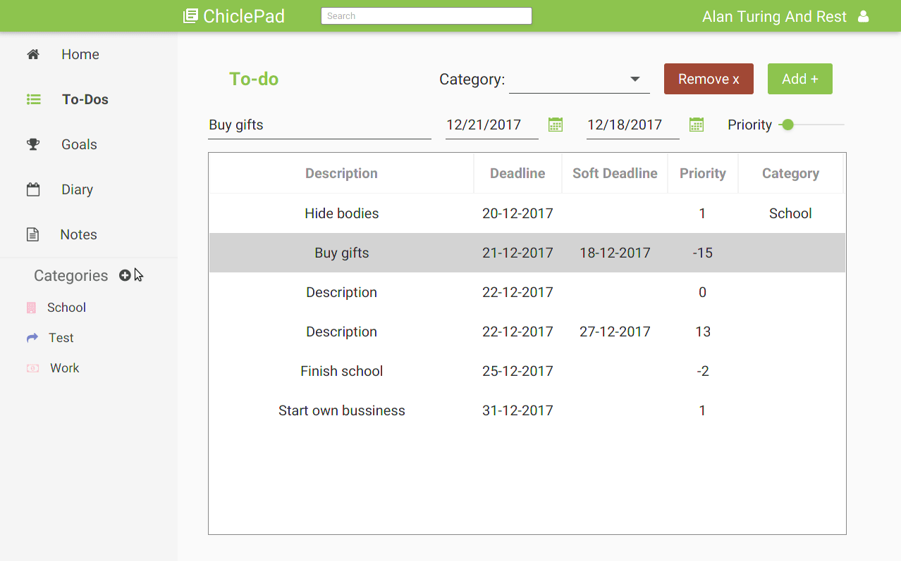
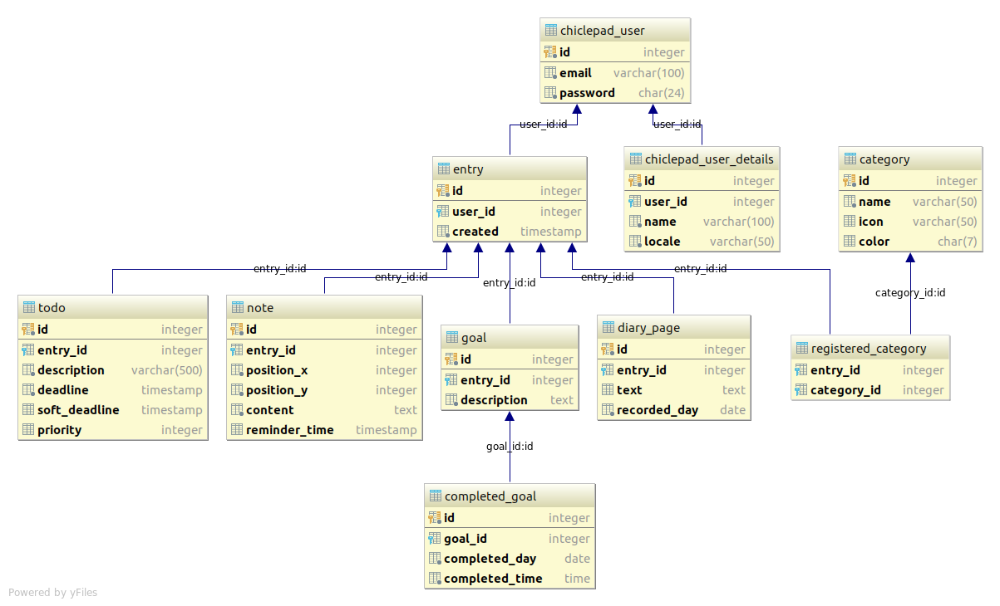

# ChiclePad backend
Java backend for the ChiclePad application. 

## Demo




## Tech Stack
In order to run the backend you need these:
- [Oracle Java 9](http://www.oracle.com/technetwork/java/javase/downloads/index.html)
- [Maven](https://maven.apache.org/)
- [PostgreSQL](https://www.postgresql.org)

And some knowledge of [JUnit 5](http://junit.org/junit5/) and 
[JavaFX](http://www.oracle.com/technetwork/java/javase/overview/javafx-overview-2158620.html) is required.  
Additional dependencies can be found in `pom.xml` file. Such as 
[AssertJ](http://joel-costigliola.github.io/assertj/), [Spring](https://spring.io/), 
[JFoenix](http://www.jfoenix.com/).

## Setup

Install dependencies on your system: 
#### Ubuntu
Oracle Java 9
```bash
$ sudo add-apt-repository ppa:webupd8team/java
$ sudo apt update
$ sudo apt install oracle-java9-installer
```

Maven
```bash
$ sudo apt install maven
```
And then install dependencies in your project
```bash
$ mvn install:install-file -Dfile=src/main/resources/jfoenix-9.0.0.jar -DgroupId=com.jfoenix -DartifactId=jfoenix -Dversion=9.0.0 -Dpackaging=jar -DgeneratePom=true
$ mvn install
```

PostgreSQL
```bash
$ sudo apt install postgresql
$ sudo -u postgres psql

postgres=# CREATE DATABASE chiclepad;
postgres=# \connect chiclepad
chiclepad=# CREATE SCHEMA public;
chiclepad=# ALTER SCHEMA public OWNER to postgres;
```
Execute `schema.sql` script from `/backend/postgress` folder to initialize the schema.
```
chiclepad=# \q
```

### Running java
- Until a new version of postgresql driver is out, the project has to be run with a `--illegal-access=warn` 
VM flag to take reflection errors introduced in java 9 as warnings.
- Configure `/postgress/connection.properties` file to match your database credentials.

### Running tests
- For database manager tests to pass a dummy database using default properties is needed. 
(the properties are set to default for postgresql so no configuration should be needed)
```properties
host=localhost
port=5432
database=chiclepad
username=postgres
password=root
```

## How To Contribute

1. Fork the repository
2. Create new branch `$ git chceckout -b my_new_branch`
3. Commit your changes `$ git add *` `$ git commit`
4. Make sure you're up to date `$ git pull -r upstream devel` (where upstream is the main repository)
5. Upload to your fork `$ git push -u origin my_new_branch`
6. Submit a Pull Request

## Database model

